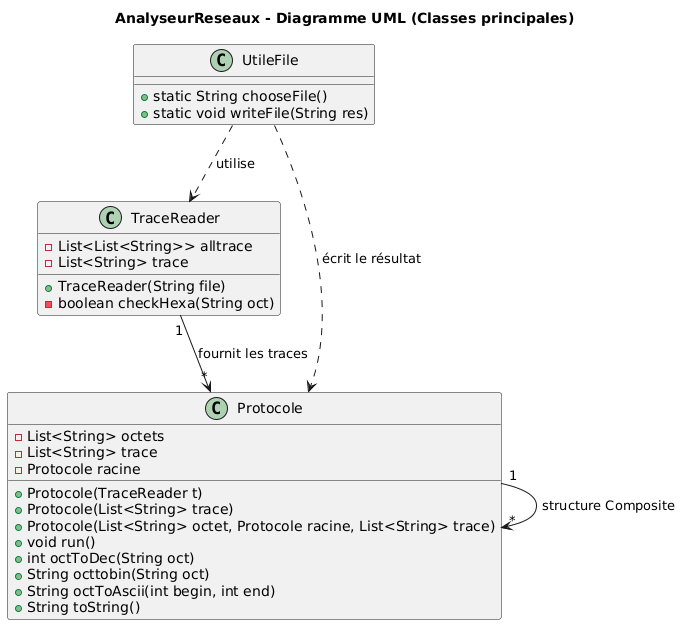
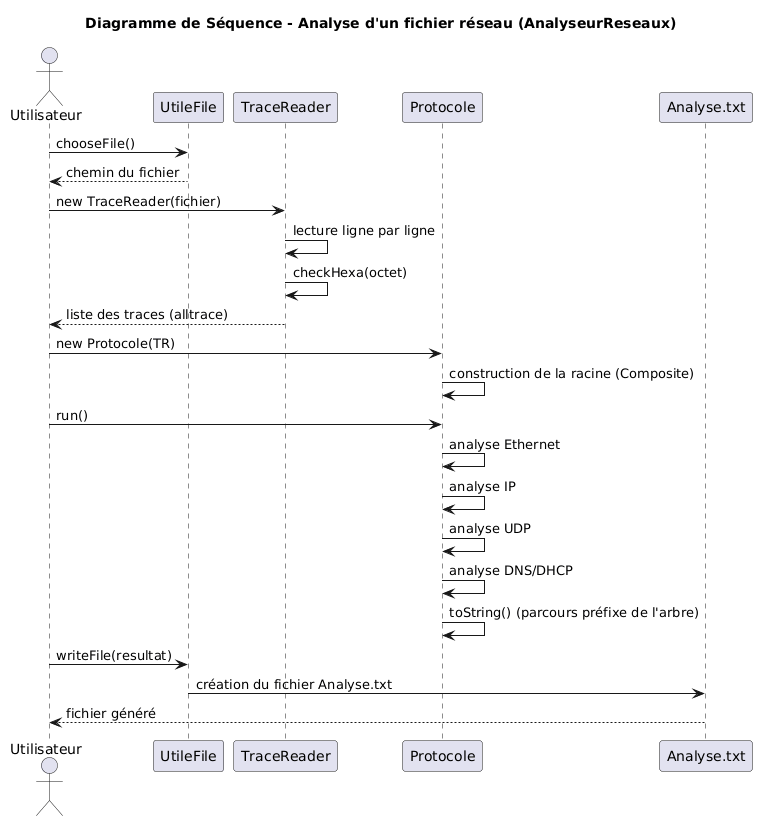

# 📡 Analyseur de Protocoles Réseaux (Offline) — Java

AnalyseurReseaux est un **analyseur de trames Ethernet offline**, développé en **Java**, permettant de décoder des fichiers de traces d’octets capturés sur un réseau.  
Le logiciel identifie et analyse les protocoles suivants :

- **Ethernet**  
- **IP**  
- **UDP**  
- **DNS / DHCP**

Il s’agit d’un projet mettant en œuvre une architecture en **design pattern Composite**, permettant de représenter les protocoles sous forme d’un arbre (racine → nœuds → feuilles).

---

## Fonctionnalités

- Lecture d’un fichier de traces hexadécimales  
- Vérification de la validité des offsets et des octets  
- Décodage des protocoles réseau (Ethernet → IP → UDP → DNS/DHCP)  
- Conversion des octets :
  - Hexadécimal → Décimal  
  - Hexadécimal → Binaire  
  - Octets → ASCII  
- Génération d’un fichier texte contenant l’analyse complète  
- Architecture extensible via le pattern **Composite**

---

## Architecture du projet

Le projet repose sur trois classes principales :

### 🔹 `TraceReader`  
Analyse un fichier ligne par ligne et extrait les trames réseau.  
Fonctionnalités principales :

- Détection des offsets (`0000`) pour séparer les trames  
- Vérification du format hexadécimal (`checkHexa`)  
- Construction d’une liste de toutes les traces (`alltrace`)  
- Gestion des erreurs en cas d’offset invalide

### 🔹 `UtileFile`  
Utilitaires de gestion de fichiers :

- `chooseFile()` : sélection d’un fichier via une interface utilisateur  
- `writeFile(String res)` : création du fichier `Analyse.txt` contenant le résultat  
  - Suppression automatique de l’ancien fichier si présent

### 🔹 `Protocole`  
Implémentation du **design pattern Composite** pour représenter l’arbre des protocoles :

- **Racine** : protocole construit à partir de toutes les traces  
- **Nœuds** : protocole construit à partir d’une seule trace  
- **Feuilles** : protocole construit à partir d’octets spécifiques (Ethernet, IP, UDP, DNS/DHCP)

Méthodes importantes :

- `run()` : lance l’analyse complète en commençant par Ethernet, puis IP, etc.  
- `octToDec()` : conversion hexadécimal → décimal  
- `octtobin()` : conversion hexadécimal → binaire  
- `octToAscii()` : conversion octets → caractères ASCII  
- `toString()` : construction du texte final via un parcours préfixe de l’arbre des protocoles

---

## 📂 Structure du dépôt

```
AnalyseurReseaux/
├── src/                 # Code source Java
├── data/                # Fichiers de test
├── bin/                 # Build Java (Eclipse)
├── analyseur.jar        # Version exécutable
├── UDP_DNS.txt          # Exemple de trace réseau
├── howTo.txt            # Instructions d'utilisation
├── README.md            # Documentation
└── .classpath / .project
```

---

## Utilisation

### 1. Exécuter le programme

Deux options :

#### ✔️ Via l’exécutable
```bash
java -jar analyseur.jar
```

#### ✔️ Via l’IDE (Eclipse / IntelliJ)
- Importer le projet comme **projet Java existant**
- Exécuter la classe principale dans `src/`

---

### 2. Choisir un fichier de traces
Le programme permet de sélectionner un fichier via `UtileFile.chooseFile()`.

Format attendu :

```
0000  ff ff ff ff ff ff 08 00 ...
0010  45 00 00 3c ...
...
```

---

### 3. Résultat
Un fichier **Analyse.txt** est généré automatiquement, contenant :

- L’analyse Ethernet  
- L’analyse IP  
- L’analyse UDP  
- L’analyse DNS/DHCP  
- Les conversions ASCII, binaires, décimales  
- Le parcours complet de l’arbre des protocoles

---

## Roadmap (suggestions)

- Ajout du protocole **TCP**  
- Export JSON / XML  
- Interface graphique JavaFX  
- Tests unitaires JUnit  
- Support des captures PCAP

---



---




